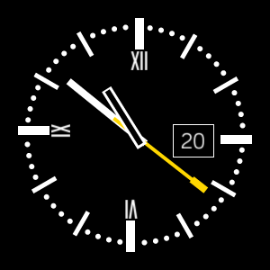

# Classic (clock/watch face for Fitbit OS)

This is an analog watch face for Fitbit OS, displaying:
 - time 
 - steps
 - heart rate
 - calories
 - floors.

## Download to use
To download the watch face directly follow this link on your smartphone: https://gam.fitbit.com/gallery/clock/236d18d3-961a-4526-be95-10765924d9b2

## Screen shot of the app

|**Classic** |
|-------|
||

## Developer instruction

To build this watch face yourself, you need to have a fitbit account and own a Fitbit watch or download fitbit Simulator. More details here: https://studio.fitbit.com/

## LICENSE

[Apache License](LICENSE).
